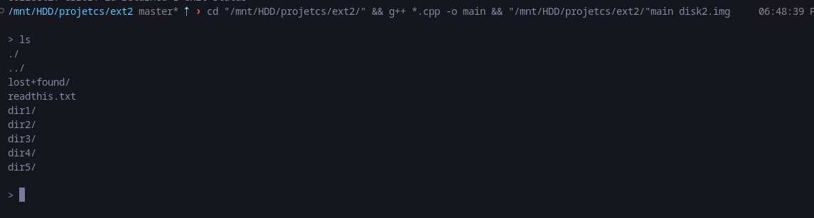
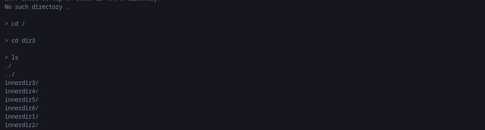
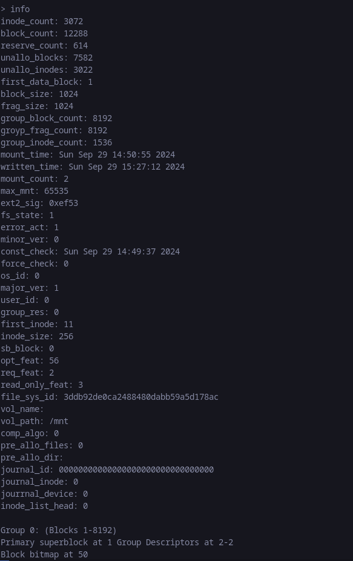

# EXT2FS Reader

This project focuses on the low-level implementation of the filesystem and file management, specifically targeting the ext2 filesystem, which is popular on Linux.

## Currently Capable Of

- **Read Core Structures**: Parse the filesystem image to extract and display the contents of the superblock and block group descriptors.
- **Traverse Directories**: Starting from the root directory, your program must be able to recursively traverse all subdirectories, printing the complete layout of the filesystem.

## Run

```bash
g++ *.cpp -o main && ./main <img_file>
```

## Working

The program starts from `main.cpp`, which runs in an infinite loop (until input is `exit`).

There are a few commands implemented so far:
- `info` (show info, similar to `dumpe2fs`)
- `ls` (show info about current directory)
- `cd <dir_name>` (change directory to `<dir_name>`)
- `cat` (read contents of files)

### Commands to Add (Yet)

- `nano` (e.g., integrate with a text editor to pass data)

### Features Implemented So Far

- Reading general info of the filesystem.
- Traversing through the file structure.
- Outputting the contents of files.

### General Working of Program

The program is divided into two major classes: `Disk` and `DiskUtil`. Their names explain enough about the classes.

`Disk` is for functions related to class data and storing data in memory.

`DiskUtil` is for miscellaneous functions and other commands on the disk.

There is a file `struct.hpp` which contains all structs of the program.

## Some Screenshots of the Software





